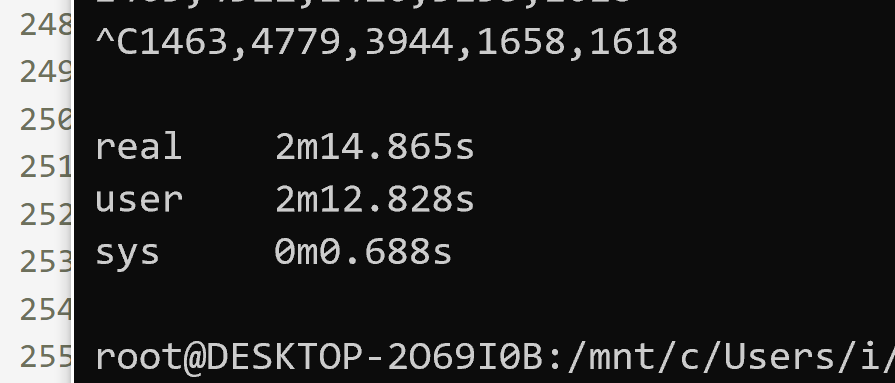

# camp_huawei

#### TODO:

1. [x] 基础算法
2. [x] 多线程优化
3. [x] 验证正确性
4. [x] 造大数据验证速度
5. [x] 新算法的 Demo
6. [x] Johnson 通过，800s
7. [x] 双向广搜 Demo
8. [x] 双向广搜通过，44s

#### 注意事项：

1. 自环

#### 算法

[Tarjan 找强连通分量](./Algorithms/Tarjan.md)

[Johson 找图中所有简单环](./Algorithms/Johson's-Algorithm.md)

#### 效率截图

递归写法 + vec + 出度+入度 rank，90w 数据

